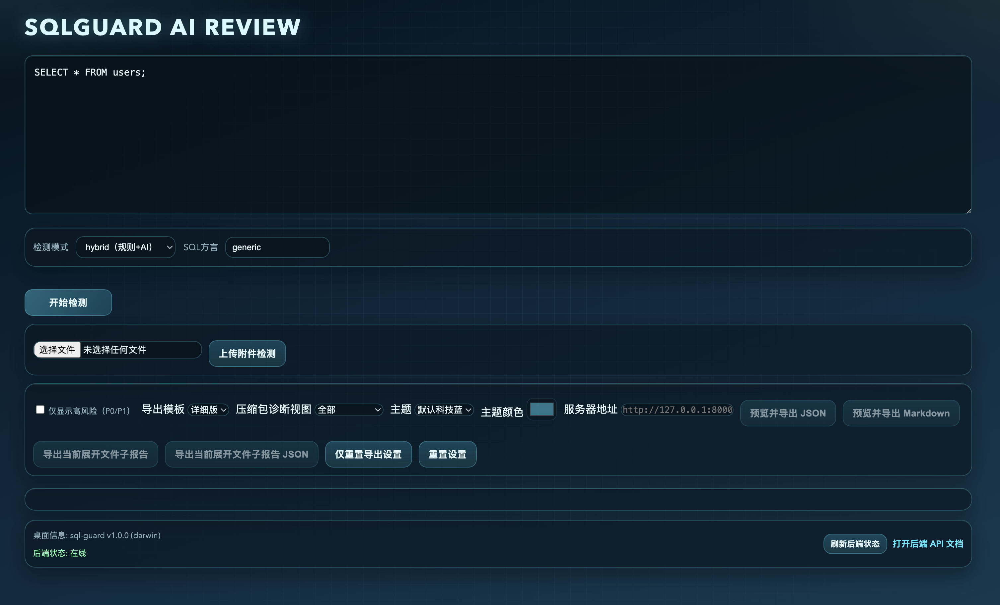

# SQLGuard 

基于 Electron 与 Python 的 AI 式 SQL Review 工具

## GUI快照



## 功能

- SQL 输入与检测
- 风险 SQL 检测
- AI Review（可接入真实模型）
- Electron 桌面客户端
- Python FastAPI 后端
- 上传 `.sql/.txt/.zip` 附件检测（zip 支持多 SQL 文件批量分析）
- ZIP 上传支持逐文件容错分析：单个文件异常不会中断整体审核，并返回跳过/失败统计
- ZIP 会自动忽略隐藏文件（`.开头`）与系统元数据目录（如 `__MACOSX/`）
- ZIP 分析并发可配置：`SQLGUARD_ZIP_ANALYZE_CONCURRENCY`（默认 4，范围 1-16）
- 前端支持压缩包诊断视图筛选：全部 / 仅失败文件 / 仅跳过文件 / 隐藏诊断明细
- ZIP 结果新增同内容分组（content_group）：同组文件复用同一次分析结果，确保一致性并可追溯
- 压缩包诊断视图新增“仅重复内容组”，用于快速定位重复 SQL 文件
- 压缩包目录树展示与分文件问题明细展开
- 一键导出检测报告（JSON / Markdown，支持简版与详细版）
- 导出前预览弹窗（支持确认下载）
- 预览内容关键字搜索与高亮命中提示
- 预览搜索支持上一处/下一处跳转
- 预览命中进度常驻显示（x/y），无命中时跳转按钮自动禁用
- 搜索关键字清空后自动回到预览顶部
- 预览跳转动画可配置（平滑 / 瞬时）
- 导出当前展开文件子报告（Markdown / JSON，适用于压缩包分文件结果）
- 预览搜索快捷键：`Enter` 下一处，`Shift+Enter` 上一处
- 子报告导出统一支持“预览后确认下载”
- UI 设置自动记忆（高风险筛选、导出模板、跳转动画、检测模式、SQL 方言）
- 一键重置 UI 设置（清空本地记忆并恢复默认）
- 重置前二次确认，避免误触
- 支持仅重置导出相关设置（不影响检测模式与 SQL 方言）
- 重置确认弹窗使用统一应用内样式（替代浏览器默认 confirm）
- 高风险筛选开关（仅显示 P0/P1）
- 主题选择与自定义主题色（支持预设主题 + 自定义颜色）
- 服务器地址可在设置面板动态配置，无需重启，留空回退默认 `http://127.0.0.1:8000`

## 启动方式

### 1. 启动 Python 后端

```bash
# Switch code directory
cd sql-guard

# Create a virtual environment
python3 -m venv myenv

# Start the virtual environment
source myenv/bin/activate

# Install dependencies
pip install -r requirements.txt

# run 
python backend/main.py

```

默认启动：
http://127.0.0.1:8000

如需让外部设备访问（局域网/公网），可配置监听地址：

```bash
export SQLGUARD_HOST="0.0.0.0"
export SQLGUARD_PORT="8000"
python main.py
```

外部访问示例：

- 局域网：`http://你的内网IP:8000/docs`
- 公网：`http://你的公网IP或域名:8000/docs`

注意：

- 需要在服务器安全组/防火墙放行端口（如 `8000`）
- 公网部署建议配反向代理（Nginx/Caddy）并启用 HTTPS
- 当前 CORS 为 `*`，若对外提供服务，建议限制来源域名

---

### 2. 启动 Electron

```bash
cd electron
npm install
npm start
```

### macOS 安装后提示“已损坏”或无法打开

如果通过 GitHub Actions 生成的 macOS 包安装后，首次打开出现 Gatekeeper 拦截，通常可以先清除隔离属性再打开：

```bash
# 1. 对下载的 dmg 清除隔离属性（把文件名替换成实际下载文件）
xattr -dr com.apple.quarantine ~/Downloads/sql-guard-*.dmg

# 2. 对安装后的 app 再清除一次隔离属性
xattr -dr com.apple.quarantine /Applications/sql-guard.app

# 3. 首次建议用右键 -> 打开，或直接再次双击
open /Applications/sql-guard.app
```

如果仍然提示“已损坏”，可再执行一次：

```bash
spctl --add --label "sql-guard-local" /Applications/sql-guard.app
```

说明：

- 这是 macOS 对未公证应用的典型拦截，不代表文件真的损坏。
- 若要彻底消除这类弹窗，需要为 macOS 构建配置 Apple Developer 证书签名和 notarization。

---

## Docker 环境部署

下面只部署后端 API（FastAPI）。Electron 客户端可继续本地运行，并把服务器地址改为 Docker 所在主机地址。

### 方案一：单命令快速启动（不写 Dockerfile）

在项目根目录执行：

```bash
docker run --rm -it \
	-p 8000:8000 \
	-e SQLGUARD_HOST=0.0.0.0 \
	-e SQLGUARD_PORT=8000 \
	-e SQLGUARD_AI_PROVIDER=ollama \
	-e SQLGUARD_OLLAMA_BASE_URL=http://host.docker.internal:11434 \
	-e SQLGUARD_OLLAMA_MODEL=qwen3.5:9b \
	-e SQLGUARD_OLLAMA_HTTP_TIMEOUT=300 \
	-v "$PWD/backend":/app \
	-w /app \
	python:3.13-slim \
	sh -c "pip install -r requirements.txt && python main.py"
```

启动后可访问：

- `http://127.0.0.1:8000/docs`

说明：

- 若你的 Ollama 不在本机，请把 `SQLGUARD_OLLAMA_BASE_URL` 改成实际地址。
- Linux 主机如不支持 `host.docker.internal`，可改为宿主机网卡 IP。

### 方案二：docker compose（推荐长期使用）

1. 准备环境变量文件：

```bash
cp .env.example .env
```

2. 按需编辑 `.env`（例如修改 `SQLGUARD_OLLAMA_BASE_URL` 为你的模型服务地址）。

3. 在项目根目录新建 `docker-compose.yml`（已提供可直接使用的版本）：

```yaml
services:
	sqlguard-backend:
		image: python:3.13-slim
		container_name: sqlguard-backend
		working_dir: /app
		env_file:
			- ./.env
		volumes:
			- ./backend:/app
		command: sh -c "pip install -r requirements.txt && python main.py"
		environment:
			SQLGUARD_HOST: ${SQLGUARD_HOST:-0.0.0.0}
			SQLGUARD_PORT: ${SQLGUARD_PORT:-8000}
			SQLGUARD_AI_PROVIDER: ${SQLGUARD_AI_PROVIDER:-ollama}
			SQLGUARD_OLLAMA_BASE_URL: ${SQLGUARD_OLLAMA_BASE_URL:-http://host.docker.internal:11434}
			SQLGUARD_OLLAMA_MODEL: ${SQLGUARD_OLLAMA_MODEL:-qwen3.5:9b}
			SQLGUARD_OLLAMA_HTTP_TIMEOUT: ${SQLGUARD_OLLAMA_HTTP_TIMEOUT:-300}
		ports:
			- "${SQLGUARD_PORT:-8000}:8000"
		restart: unless-stopped
```

4. 启动服务：

```bash
docker compose up -d
```

5. 查看后端是否就绪（容器内置健康检查，间隔 15s，最多重试 3 次）：

```bash
docker compose ps
# STATUS 列变为 healthy 表示后端就绪
```

6. 查看日志：

```bash
docker compose logs -f sqlguard-backend
```

7. 停止服务：

```bash
docker compose down
```

### 远程访问与安全建议

- 局域网访问：`http://宿主机内网IP:8000/docs`
- 公网访问：需放行防火墙并做端口映射（或使用反向代理）
- 生产环境建议：
	- 使用 Nginx/Caddy 反向代理并启用 HTTPS
	- 限制 CORS 来源，不要长期保持 `*`
	- 按需增加鉴权（如 API Token）

### Electron 客户端如何连接 Docker 后端

- 打开客户端设置中的“服务器地址”
- 填写：`http://宿主机IP:8000`
- 点击“刷新后端状态”确认连通

---

## 检测规则

- SELECT *
- DELETE 无 WHERE
- UPDATE 无 WHERE
- DROP TABLE
- LIMIT 缺失

## 新增能力（规则 + AI）

- 后端支持三种模式：`rule`、`ai`、`hybrid`
- `/review` 兼容旧请求，同时支持扩展参数：
	- `mode`：检测模式，默认 `hybrid`
	- `dialect`：SQL 方言，如 `mysql` / `postgresql`
	- `max_issues`：最大返回问题数，默认 20
- 新增 `/config` 接口，用于查看 AI 配置是否生效
- 新增 `/explain` 接口，返回 SQL 语句结构、表名和执行风险洞察
- 新增 `/gitlab/mr-review` 接口，可直接审核 MR Diff 里的 SQL 变更
- 基于 `sqlglot` 的 AST 分析替代纯字符串匹配，规则更稳定

### AI 配置（OpenAI 兼容接口）

在启动后端前设置环境变量：

```bash
export SQLGUARD_AI_API_KEY="你的API_KEY"
export SQLGUARD_AI_BASE_URL="https://api.openai.com/v1"
export SQLGUARD_AI_MODEL="gpt-4o-mini"
export SQLGUARD_AI_TEMPERATURE="0"
export SQLGUARD_AI_SEED="42"
export SQLGUARD_AI_HTTP_TIMEOUT="30"
```

如果不配置 `SQLGUARD_AI_API_KEY`，系统会自动跳过 AI 分析并返回提示，不影响规则检测。

### Ollama 配置（本地模型）

```bash
export SQLGUARD_AI_PROVIDER="ollama"
export SQLGUARD_OLLAMA_BASE_URL="http://127.0.0.1:11434"
export SQLGUARD_OLLAMA_MODEL="qwen3.5:9b"
export SQLGUARD_AI_TEMPERATURE="0"
export SQLGUARD_AI_SEED="42"
export SQLGUARD_OLLAMA_HTTP_TIMEOUT="300"
```

### DeepSeek / Qwen 配置（OpenAI 兼容）

DeepSeek、Qwen 云端接口如果提供 OpenAI 兼容协议，可直接复用：

```bash
export SQLGUARD_AI_PROVIDER="openai"
export SQLGUARD_AI_API_KEY="你的云端API_KEY"
export SQLGUARD_AI_BASE_URL="你的OpenAI兼容BaseURL"
export SQLGUARD_AI_MODEL="deepseek-chat 或 qwen-plus"
```

### 请求示例

```bash
curl -X POST http://127.0.0.1:8000/review \
	-H "Content-Type: application/json" \
	-d '{
		"sql": "DELETE FROM users;",
		"mode": "hybrid",
		"dialect": "mysql",
		"max_issues": 20
	}'
```

### Explain 分析示例

```bash
curl -X POST http://127.0.0.1:8000/explain \
	-H "Content-Type: application/json" \
	-d '{
		"sql": "SELECT * FROM users ORDER BY RAND();",
		"dialect": "mysql"
	}'
```

### GitLab MR Review 示例

```bash
curl -X POST http://127.0.0.1:8000/gitlab/mr-review \
	-H "Content-Type: application/json" \
	-d '{
		"title": "feat: 调整用户查询",
		"description": "MR SQL 风险检查",
		"mode": "hybrid",
		"dialect": "mysql",
		"diff": "+ SELECT * FROM users;\n+ DELETE FROM users;"
	}'
```

---

## 推荐升级方向

- [已支持] 集成 sqlglot AST 分析
- [已支持] 接入 Ollama
- [已支持] 接入 DeepSeek / Qwen（OpenAI 兼容）
- [已支持] Explain 分析接口
- [已支持] GitLab MR Review 接口

## 后端架构（已拆分）

backend 目录已从单文件重构为分层结构，便于扩展：

```text
backend/
	main.py                 # 仅保留启动入口
	app/
		server.py             # FastAPI 创建与中间件配置
		config.py             # 环境变量配置读取
		schemas.py            # 请求模型
		api/
			routes.py           # 路由层
		services/
			sql_parser.py       # SQL 解析与语句拆分
			rule_engine.py      # 规则引擎
			ai_client.py        # AI 客户端（OpenAI/Ollama）
			analyzer.py         # 规则与 AI 编排
			explainer.py        # Explain 分析
			mr_review.py        # MR Diff SQL 审核
```

扩展建议：

- 新增规则：优先改 `services/rule_engine.py`
- 新增 AI 提供方：在 `services/ai_client.py` 增加 provider 分支
- 新增业务接口：在 `api/routes.py` 注册路由，复用 `services/*`

## Electron 架构（已拆分）

Electron 端也已从单文件拆分为模块结构：

```text
electron/
	main.js                # 仅保留主进程入口
	main/
		config.js            # BrowserWindow 与安全配置
		window.js            # 窗口创建
		lifecycle.js         # 应用生命周期管理
		ipc.js               # IPC handler 注册
	preload.js             # 预加载薄入口
	preload/
		index.js             # contextBridge 暴露入口
		api.js               # 渲染层可调用的安全 API
	src/
		app.js               # 渲染层入口与事件绑定
		api.js               # 后端 HTTP 请求
		ui.js                # 视图渲染与交互
		reports.js           # 导出与预览内容生成
		theme.js             # 主题管理（预设 + 自定义色）
		constants.js         # 常量与 getApiBase()（动态服务器地址）
		settings.js          # 设置持久化（含服务器地址、主题）
```

当前 preload 已暴露 `window.sqlGuardDesktop`：

- `getMeta()`：获取应用基础信息（名称、版本、平台）
- `openExternal(url)`：在白名单策略下打开外链（当前仅允许 `localhost/127.0.0.1`）

UI 底栏已新增：

- 桌面应用信息展示（名称/版本/平台）
- 后端在线状态展示与"刷新后端状态"按钮

**服务器地址配置**：

- 设置面板提供"服务器地址"输入框，留空时回退默认 `http://127.0.0.1:8000`
- 修改后自动保存并刷新后端连通状态，无需重启应用
- 所有 API 请求通过 `getApiBase()` 动态读取，不再硬编码

Electron DevTools 策略：

- 开发环境默认开启 DevTools
- 生产包（或 `NODE_ENV=production`）默认关闭 DevTools
- 可通过 `ELECTRON_OPEN_DEVTOOLS=1|0` 强制覆盖
